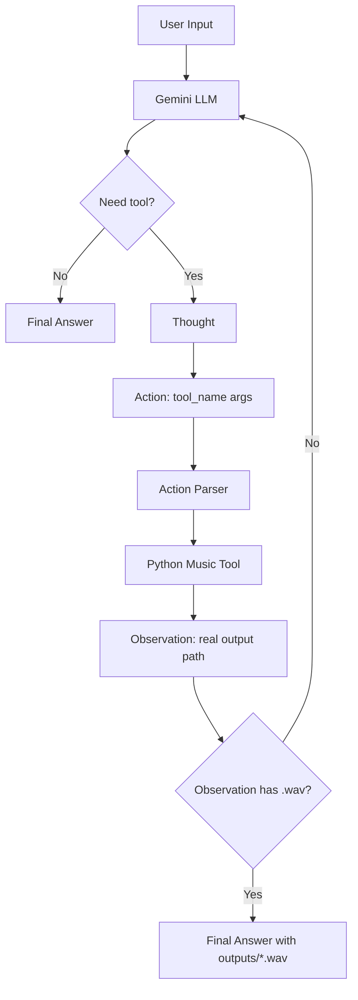

# Group Report: Lab 3 - Production-Grade Agentic System

- **Team Name**: Ke lot duong
- **Team Members**: Vu Quang Vinh, Hoang Duc Dung, Dinh Van Anh Khoi, Doan Cong Phu
- **Deployment Date**: 2026-06-01

---

## 1. Executive Summary

Our project compares a text-only music chatbot with a ReAct-based AI Music Agent. The target task is not only to answer music questions, but also to create a real audio artifact: a `.wav` file saved in `outputs/`.

- **Baseline result**: Chatbot handles music-theory and ideation prompts well, but cannot create files.
- **Agent v1 result**: Agent could call music tools, but sometimes hallucinated observations or failed to stop.
- **Agent v2 result**: Guardrails improved reliability by forcing real backend observations and preventing fake file paths.
- **Main outcome**: ReAct is necessary for artifact generation because the LLM must act through tools, not just describe an answer.

---

## 2. System Architecture & Tooling

### 2.1 ReAct Loop Implementation

The system uses a bounded ReAct loop with `max_steps=5`:

1. User sends a music request.
2. Gemini generates `Thought` and optionally an `Action`.
3. The backend parses the action.
4. Python executes the selected music tool.
5. Tool output is appended as `Observation`.
6. The agent continues until it can produce `Final Answer`.

Important v2 guardrail: if an LLM response contains an `Action`, the backend always executes the action first and ignores any `Observation` or `Final Answer` written by the model in the same response.

### 2.2 Tool Definitions

| Tool Name | Input Format | Use Case |
| :--- | :--- | :--- |
| `create_midi` | key-value args / JSON-like args | Creates a symbolic `.mid` file from title, mood, key, tempo, and bars. |
| `midi_to_wav` | key-value args / JSON-like args | Reads a generated `.mid` file and renders a playable `.wav`. |
| `create_music_wav` | key-value args / JSON-like args | All-in-one wrapper: creates MIDI and WAV in one action to reduce loop count. |

### 2.3 LLM Provider

- **Primary**: Gemini via REST API, configured by `.env`.
- **Current default model**: `gemini-2.0-flash-lite`.
- **Fallback model list**: `gemini-2.5-flash-lite`, `gemini-2.0-flash`, `gemini-flash-lite-latest`, `gemini-flash-latest`.

---

## 3. Telemetry Dashboard

The system logs structured JSON events to `logs/YYYY-MM-DD.log`.

Tracked events:

- `CHATBOT_START`, `CHATBOT_RESPONSE`, `CHATBOT_END`
- `AGENT_START`, `LLM_RESPONSE`, `TOOL_CALL`, `PARSER_ERROR`, `TOOL_ERROR`, `AGENT_END`
- `LLM_METRIC`

Tracked metrics:

- Prompt tokens
- Completion tokens
- Total tokens
- Latency in ms
- Completion-to-prompt ratio
- Tokens per second
- Estimated cost

Observed examples from test traces:

| Metric | Example Value |
| :--- | :--- |
| Chatbot latency | ~6.25s for `tao nhac 3 bars, tempo 80` |
| Agent successful drill trace | 2 LLM loops |
| Agent LLM latency for drill trace | 6.09s + 5.48s |
| Output artifact | `outputs/drill_track.wav` |

---

## 4. Root Cause Analysis - Failure Traces

### Case Study: Hallucinated Observation and Fake File Path

- **Input**: `tao cho toi ban nhac drill 8bars tempo 120`
- **Observed failure**:

```text
Action: create_music_wav(title='Drill Track', mood='energetic', key='Am', tempo=120, bars=8, waveform='sine')
Observation: File created. /tmp/music_drill_track_energetic_Am_120_8.wav
Final Answer: /tmp/music_drill_track_energetic_Am_120_8.wav
AGENT_END: steps=1, status=final_answer
```

- **Root cause**:
  - The model wrote its own `Observation` and `Final Answer`.
  - The old loop checked `Final Answer` before executing `Action`.
  - The backend stopped early, so no real file was created in `outputs/`.

- **Fix**:
  - Reordered the ReAct loop: parse and execute `Action` before accepting `Final Answer`.
  - Removed hallucinated continuations from the prompt history with `_remove_hallucinated_tool_continuation`.
  - Strengthened the system prompt:
    - Do not write `Observation`.
    - Do not invent file paths.
    - Do not write `Final Answer` in the same response as `Action`.
    - Only use paths returned by real tool observations.

---

## 5. Ablation Studies & Experiments

### Experiment 1: Prompt v1 vs Prompt v2

| Version | Prompt / Logic | Failure Mode | Result |
| :--- | :--- | :--- | :--- |
| v1 | Basic ReAct format only | LLM sometimes wrote fake `Observation` and `/tmp/...wav` paths. | Agent stopped early and output file did not exist. |
| v2 | Strict rules: one action per turn, no self-written Observation, no fake paths. | Model may still hallucinate, but backend ignores hallucinated continuation. | Tool runs and returns real `outputs/*.wav`. |

### Experiment 2: Chatbot vs Agent

| Category | Test Case | Chatbot Baseline | ReAct Agent | Winner |
| :--- | :--- | :--- | :--- | :--- |
| Music theory | `key cua tone si thu la gi` | Direct answer, low overhead. | Also answers, but ReAct orchestration is unnecessary. | Chatbot |
| Music theory | `Vong hop am C-G-Am-F gom nhung not nao?` | Direct text answer is enough. | Can answer, but tool use would be wasteful. | Chatbot |
| Audio generation | `tao nhac 3 bars, tempo 80` | Text-only explanation, no file. | Can create a WAV artifact. | Agent |
| Audio generation | `tao cho toi ban nhac drill 8bars tempo 120` | Long style description, no file. | Creates `outputs/drill_music.wav`. | Agent |
| Audio generation | `Tao mot doan nhac calm key C dai 1 bar va xuat file wav` | Text-only baseline limitation. | Creates `outputs/calm_music.wav`. | Agent |

---

## 6. Production Readiness Review

- **Security**: Validate tool arguments with JSON schema or Pydantic before execution.
- **Guardrails**: Keep `max_steps=5`; reject absolute output paths and path traversal attempts.
- **Scalability**: Move WAV rendering into a background job queue for longer audio tasks.
- **Routing**: Use a smart router: music-theory questions go to chatbot; artifact-generation requests go to the agent.
- **Observability**: Keep structured logs and metric events for debugging and grading.

---

## 7. Tool Design Evolution

| Version | Tool Spec | Problem Found | Improvement |
| :--- | :--- | :--- | :--- |
| v1 | `create_midi(title, mood, key, tempo, bars)` | Created `.mid`, but user wanted playable `.wav`. | Added a conversion tool. |
| v2 | `create_midi(...)` + `midi_to_wav(midi_path, waveform)` | Two-step traces increased parser and loop risks. | Added stricter prompt rules and true backend observations. |
| v3 | `create_music_wav(title, mood, key, tempo, bars, waveform)` | Most demo prompts did not need a visible two-step trace. | All-in-one wrapper reduced loop count and improved reliability. |
| v4 | Normalized tool inputs | Gemini generated `mood='energetic'`, `mood='drill'`, `key='A minor'`, etc. | Tool now accepts more mood/key variants. |

Design lesson: a good tool spec must be easy for both humans and LLMs to call correctly.

---

## 8. Trace Quality Evidence

### Successful Trace: Calm WAV Generation

- **Input**: `Tao mot doan nhac calm key C dai 1 bar va xuat file wav`

```text
AGENT_START: model=gemini-2.0-flash-lite
LLM_RESPONSE step=1:
Thought: The user wants a calm music piece...
Action: create_music_wav(title='calm_music', mood='calm', key='C', tempo=80, bars=1)
TOOL_CALL step=1:
Observation: outputs\calm_music.wav
LLM_RESPONSE step=2:
Final Answer: outputs\calm_music.wav
AGENT_END: status=final_answer
```

Result: `.wav` artifact was created in `outputs/` and could be played in the demo UI.

### Failed Trace: Fake Path

- **Input**: `tao cho toi ban nhac drill 8bars tempo 120`

```text
Action: create_music_wav(title='Drill Track', mood='energetic', key='Am', tempo=120, bars=8, waveform='sine')
Observation: File created. /tmp/music_drill_track_energetic_Am_120_8.wav
Final Answer: /tmp/music_drill_track_energetic_Am_120_8.wav
```

Result: no matching file existed in `outputs/`.

### Fixed Trace: Same Failure Class After Guardrails

- **Input**: `create a drill music track 8 bars tempo 120 and export wav`

```text
LLM_RESPONSE step=1:
Action: create_music_wav(title='Drill Track', mood='dark', key='A minor', tempo=120, bars=8, waveform='sine')
TOOL_CALL step=1:
Observation: outputs\drill_track.wav
LLM_RESPONSE step=2:
Final Answer: The WAV file has been successfully created at outputs\drill_track.wav
AGENT_END: steps=2, status=final_answer
```

Result: the backend ignored the fake model-written continuation and created the real file.

---

## 9. Evaluation & Analysis Table

| # | Test Case | Chatbot Result | Agent Result | Agent Loops | Observed Latency | Winner |
| :--- | :--- | :--- | :--- | :--- | :--- | :--- |
| 1 | `tao nhac 3 bars, tempo 80` | Text-only explanation; no artifact. | Creates WAV when routed to agent. | 1-2 | ~6.2s chatbot trace | Agent |
| 2 | `tao cho toi ban nhac drill 8bars tempo 120` | Long drill style description; no `.wav`. | Created `outputs\drill_music.wav`. | 2 | ~17.0s agent trace | Agent |
| 3 | `create a drill music track 8 bars tempo 120 and export wav` | Not used in final comparison. | Created `outputs\drill_track.wav`. | 2 | 6.09s + 5.48s LLM latency | Agent |
| 4 | `Tao mot doan nhac calm key C dai 1 bar va xuat file wav` | Text-only baseline limitation. | Created `outputs\calm_music.wav`. | 2 | 5.65s + 5.00s LLM latency | Agent |
| 5 | `key cua tone si thu la gi` | Direct music-theory answer. | Direct final answer, no tool. | 1 | ~17.7s agent trace | Chatbot |
| 6 | `Vong hop am C-G-Am-F gom nhung not nao?` | Direct text answer is enough. | Possible but unnecessary overhead. | 1 | ReAct overhead expected | Chatbot |

Summary: Chatbot is best for direct knowledge tasks. ReAct Agent is best for tasks requiring real file creation.

---

## 10. Flowchart & Group Insights



Group insights:

- Chatbot is cheaper and simpler for conceptual music questions.
- Agent is required when the desired output is a real artifact.
- The trace is the truth; logs exposed the hallucinated `/tmp/...wav` bug immediately.
- Tool descriptions are part of the product surface for the LLM.
- Guardrails are core agent logic, not optional polish.

---

## 11. Bonus Evidence: Extra Monitoring

The telemetry layer now records `LLM_METRIC` events for both chatbot and agent calls.

Metric fields:

- `prompt_tokens`
- `completion_tokens`
- `total_tokens`
- `latency_ms`
- `completion_to_prompt_ratio`
- `tokens_per_second`
- `cost_estimate`

Example event shape:

```json
{
  "event": "LLM_METRIC",
  "data": {
    "provider": "google",
    "model": "gemini-2.0-flash-lite",
    "prompt_tokens": 450,
    "completion_tokens": 198,
    "total_tokens": 648,
    "latency_ms": 6093,
    "completion_to_prompt_ratio": 0.44,
    "tokens_per_second": 106.35,
    "cost_estimate": 0.00648
  }
}
```

This supports the Extra Monitoring bonus and makes the evaluation table reproducible from `logs/YYYY-MM-DD.log`.
